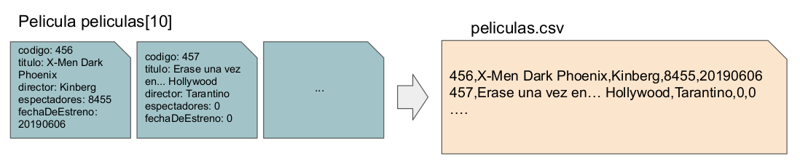

# Ejercicio 1:
Crear la función **aCsv()** que a partir de un array de peliculas, genere un archivo de texto con los atributos de cada registro Pelicula separados por comas (,)[^*]. Por ejemplo:

[^*]: CSV es un estándar de la industria. En inglés Comma Separated Values.
> **_Más info:_** https://en.wikipedia.org/wiki/Comma-separated_values