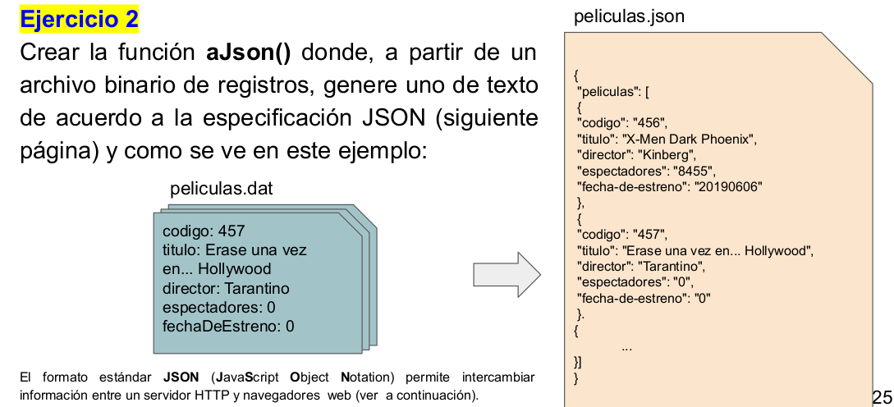

# Ejercicio 2:
Crear la función **aJson()** donde, a partir de un archivo binario de registros, genere uno de texto de acuerdo a la especificación JSON[^*] (siguiente página) y como se ve en este ejemplo:

[^*]: El formato estándar **JSON** (JavaScript Object Notation) permite intercambiar información entre un servidor HTTP y navegadores web (ver a continuación).
