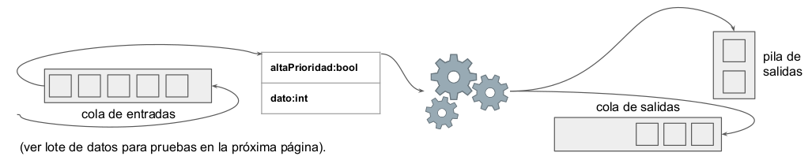

# Clase 19 - Ejercicio 2:
## Procesador de Paquetes
1. Crear un programa que procese nodos de un *buffer* FIFO (cola de entradas)
2. Calcule el valor absoluto del campo dato.
3. Guarde el resultado en el campo dato.
4. Una vez procesado, envíe el paquete con el resultado a un _buffer_ FIFO (cola de salidas) o a una pila. Todos los paquetes tienen el atributo booleano AP (alta prioridad) y cuando el valor es 1 (true), se deben agregar a un _buffer_ LIFO (pila de salidas).

## Lote de datos para pruebas:
**paquete 1** {altaPrioridad = 0, dato = 1555}
**paquete 2** {altaPrioridad = 0, dato = -5000}
**paquete 3** {altaPrioridad = 1, dato = 88}
**paquete 4** {altaPrioridad = 1, dato = -25}
**paquete 5** {altaPrioridad = 0, dato = 8537}
**paquete 6** {altaPrioridad = 1, dato = 374}
**paquete 7** {altaPrioridad = 0, dato = 4488}
Se espera que los paquetes 3, 4 y 6, una vez procesados, pasen a la pila y los restantes a la cola de salidas.